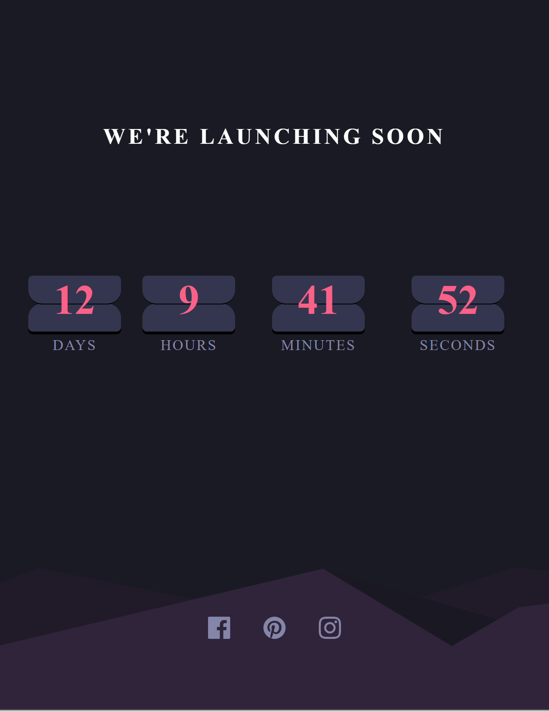

# FM_Challenge_Countdown :watch:

## 

### Table of Contents

- [Description](#description)
- [Obstacles](#obstacles)
- [Technologies](#technologies)
- [License](#license)
- [Author Info](#author-info)

---

## Description

Frontend challenge 14 days countdown.

It can be accessed at the link below.

> https://ran-countdown.netlify.app/

## Obstacles

1. To make pesudo-element have dynamic content (the countdown of the days, hours, minutes and seconds). We can make use of data attributes - having an attribute of "data-before-content" and then make use of css's attr method.

```
.card::before {
  content: attr(data-before-content);
}

```

## Technologies

- Frontend: React.js, JavaScript, HTML & CSS

---

## License

MIT License

---

## Get in touch

<div>
  <a href="https://www.instagram.com/ranwren/">
    <div>@ranwren</div>
    
  </a>
<a href="https://www.linkedin.com/in/ding-ran/">
  <div>@Ran Ding</div>
    
  </a>
</div>

[Back To The Top](#)
